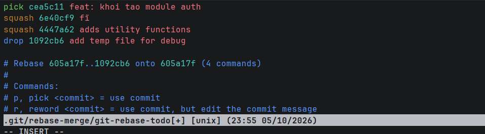

# Bài 2: Tái cấu trúc lịch sử Commit bằng Interactive Rebase

## 1. Mục tiêu

Thực hành sử dụng **Interactive Rebase** để chỉnh sửa và làm sạch lịch sử commit trên Git.

Các yêu cầu thực hiện:

- Gộp các commit nhỏ bằng `squash`.
- Đổi thông điệp commit sau khi gộp.
- Loại bỏ commit không cần thiết bằng `drop`.
- Đảm bảo lịch sử Git sau khi xử lý ngắn gọn và rõ ràng.
- Loại bỏ file thử nghiệm `temp.txt` khỏi phiên bản cuối.

---

## 2. Tạo các commit thử nghiệm

Ban đầu tạo lần lượt 4 commit:

1. `feat: khoi tao module auth`
2. `fix typo`
3. `adds utility functions`
4. `add temp file for debug`

Trong đó:

- Commit 1 tạo module `auth.js`.
- Commit 2 và 3 là các thay đổi nhỏ trên module Authentication.
- Commit 4 tạo file thử nghiệm `temp.txt`.

Kiểm tra lịch sử commit bằng:

```bash
git log --oneline
```

---

## 3. Thực hiện Interactive Rebase

Thực hiện Interactive Rebase đối với 4 commit gần nhất:

```bash
git rebase -i HEAD~4
```

Trong giao diện Interactive Rebase, cấu hình:

```text
pick   feat: khoi tao module auth
squash fix typo
squash adds utility functions
drop   add temp file for debug
```

Ý nghĩa:

- `pick`: giữ lại commit khởi tạo module Authentication.
- `squash`: gộp hai commit nhỏ vào commit chính.
- `drop`: loại bỏ hoàn toàn commit tạo file `temp.txt`.

### Ảnh cấu hình Interactive Rebase



---

## 4. Đổi thông điệp commit

Sau khi thực hiện `squash`, Git yêu cầu chỉnh sửa thông điệp của commit được gộp.

Thông điệp commit cuối cùng được đặt thành:

```text
feat: hoan thien module authentication
```

Sau đó lưu và tiếp tục quá trình Rebase bằng:

```bash
git rebase --continue
```

---

## 5. Loại bỏ file temp.txt

Commit:

```text
add temp file for debug
```

được cấu hình `drop` trong Interactive Rebase.

Do đó file thử nghiệm:

```text
temp.txt
```

không còn tồn tại trong phiên bản cuối và không còn được Git theo dõi.

Kiểm tra bằng:

```bash
git ls-files temp.txt
```

Nếu lệnh không trả về kết quả thì `temp.txt` không còn nằm trong danh sách file được Git theo dõi.

---

## 6. Kiểm tra lịch sử sau khi Rebase

Sử dụng:

```bash
git log --oneline
```

Kết quả mong muốn:

```text
xxxxxxx feat: hoan thien module authentication
xxxxxxx chore: initialize homework
```

Các commit thử nghiệm:

```text
fix typo
adds utility functions
add temp file for debug
```

không còn xuất hiện trong lịch sử cuối cùng.


## 7. Kiểm tra trạng thái Repository

Kiểm tra trạng thái bằng:

```bash
git status
```

Kết quả sau khi hoàn tất:

```text
nothing to commit, working tree clean
```

Kiểm tra file `temp.txt`:

```bash
git ls-files temp.txt
```

File không xuất hiện trong kết quả, chứng minh file thử nghiệm đã được loại bỏ khỏi phiên bản cuối.

---

## 8. Kết quả

Sau khi hoàn thành bài thực hành:

- Đã sử dụng `git rebase -i` để chỉnh sửa lịch sử commit.
- Hai commit nhỏ đã được `squash` vào commit chính.
- Commit tạo file `temp.txt` đã được `drop`.
- File `temp.txt` không còn tồn tại trong phiên bản cuối.
- Thông điệp commit cuối cùng là:

```text
feat: hoan thien module authentication
```

- Lịch sử Git sau khi xử lý ngắn gọn và rõ ràng.